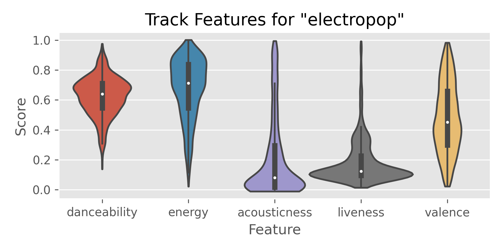
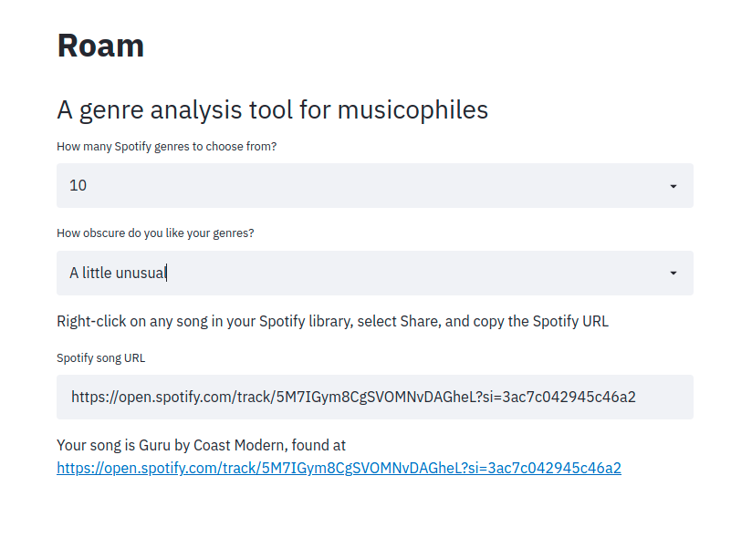

# Spotify Roam: A Hands-On Genre Exploration Tool

## Expanding your music library
While Spotify offers a range of collaborative recommender solutions to finding new music, the goal with this project was to utilize the Spotify API to generate content-based recommendations and genre predictions. This is driven by the 11 algorithmically derived track features that the Spotify API provides. These include metrics such as danceability, acousticness, energy, and more. Below is an example of the spread of a single genre, "electropop".

Currently, I'm reimplementing the predictive models into an interative tool called Roam. Roam allows you to select between obscure, normal, and mainstream genre classifiers, depending on how "out there" you want the recommendations to be. Input a song (or series of songs) that you love, and Roam returns a range of relevant genres for you to explolre. For each genre that Roam shows you, you'll also get a list of rising star artists that are making a splash in that musical territory.

## Roam app preview
I'm currently building out the Roam app through the Streamlit library and converting to Google Colab for improved performance with training the large Random Forest models (too memory instensive for my laptop). Below is an alpha version of the app interface. Stay tuned!

