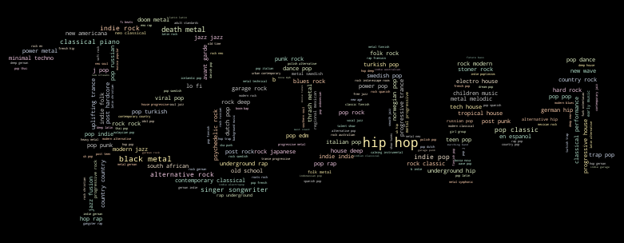
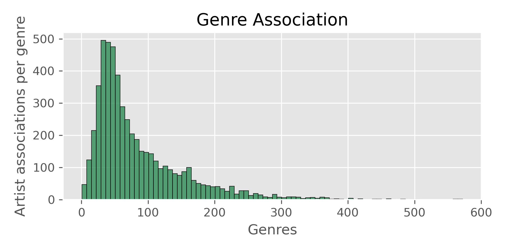

# Spotify Roam: A Hands-On Genre Exploration Tool

## Expanding your music library
Spotify is a huge platform, lots of money via advertising and subscription

Spotify is already good with elementary, hands-off recommendation

What about power users, who actively seek new music?

Roam allows you to select between obscure, normal, and mainstream genre classifiers for the music you select. Input a song (or series of songs) that you love, and Roam returns a range of relevant genres for you to dive intoIn obscure mode, you'll come across highly specific genres you may have never heard of before. In mainstream mode, the genres are familiar and highly popular. Ride down the middle with normal mode.

For each genre that Roam shows you, you'll also get a list of rising star artists that are making a splash in that musical territory.

## Working with genres
More than 5k genres listed, the most popular of which are associated with hundreds of artists

1 to 21 tags per artist, average 1.5

## Heirarchical clustering of genres
Training a classifier for the 5,300+ genres isn't super helpful, too many super niche options

Reduce genres to top 1000?